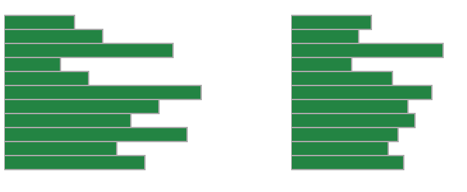
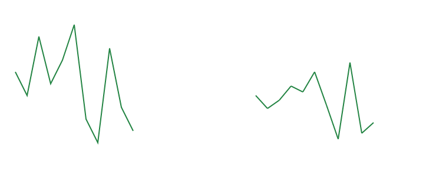
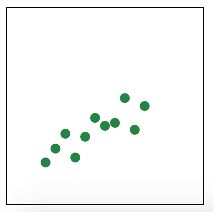

# Visualization in HCI Homework 1

*Due Monday, January 30, 12:00pm (noon)*

## Introduction to Git

Attend the lecture on git and [follow the instructions](https://cmu-vis-course.github.io/2017/lectures/lecture-git/#setting-up-your-homework-repositories) on setting up your **private** git repository for the homework. This involves creating a repository, sharing it with our github user [cmu-vis-instructor](https://github.com/cmu-vis-instructor), and announcing your project repository through [this form](https://goo.gl/forms/bnEOhXLAHT1EHaTp1). Be sure to follow all the instructions!

Edit the `README.md` file at the root of your repository to add your name and email address. Commit your changes.

In the `hw1` directory, add a text file named `hw1.md`. The text file can be empty. Commit and push your changes.

This part of your homework will be graded, so make sure that your github repository conforms to our naming guidelines, you submitted your repository url, you shared it, and that you successfully pushed everything.

**Log in to the GitHub website to ensure everything shows up correctly!**

## Introduction to HTML, CSS

**There is no need to hand anything in — this is an exercise and you can check whether you understood the concepts.**

Take this [quiz](http://www.w3schools.com/quiztest/quiztest.asp?qtest=HTML) to test your HTML knowledge, and this [one](http://www.w3schools.com/quiztest/quiztest.asp?qtest=CSS) to evaluate your understanding of CSS. If you feel confident, you can try the [JavaScript quiz](http://www.w3schools.com/quiztest/quiztest.asp?qtest=JavaScript).

## Visualization Assignment

In this assignment you will create a simple webpage with some graphical content using HTML, CSS, and SVG. These are basic building blocks that we will manipulate in later projects using Javascript and D3 in order to create visualizations. As such, it is important that you know how the pieces work on their own, before moving forward.

## The Data

This is one of the datasets from Anscombe's quartet that we discussed in Lecture 1. You will create multiple representations for this dataset, specifically a bar chart, a line chart, an area chart and a scatterplot, all using vanilla SVG. *You should write the svg manually and NOT create it using either javascript or drawing software.*

| X | Y |
--- |----
10.0	| 8.04
8.0	| 6.95
 13.0	| 7.58
 9.0	|8.81
 11.0	|8.33
 14.0	|9.96
 6.0	|7.24
 4.0	|4.26
 12.0	|10.84
 7.0	|4.82
 5.0	|5.68

## Design and Implementation

Implement your solution in a file called ``hw1.html``, which you should store in the top-level directory of the homework 1 (hw1) folder. At the top of the file add "Visualization in HCI Homework 1", your name and your e-mail address. Use the proper HTML elements to structure this information and use headings to label your charts.

You can choose your design parameters freely, i.e., things like the color, aspect ratio and size of your charts is up to you. You need to make sure, however, that the data can be clearly read.  Note that you will probably need to make some kind of transformation to the data to achieve pleasant results.  

You must use selectors to style your SVG elements, i.e., you should not use inline styling. You should also not use classes or identifiers more than necessary for each chart, i.e., one class definition per chart should be sufficient.  There are good reasons to use both, css class selectors and element selectors in this homework.

Make sure your submission is a valid HTML5 file. Check that it is valid by uploading it to the [W3C HTML Validator](https://validator.w3.org/#validate_by_upload).

### Bar Charts

Create a horizontal bar chart for both the X and the Y dimensions of the data. Your bars should be aligned along the left and point right. Here is how your bars could look like:

### Line Charts

Create a line chart for both, the X and the Y dimensions of the data. Your y-axis should have 0 at the bottom. Create the line chart for the X dimension out of a path element, and the line chart for the Y dimension out of SVG line elements. An example of the line charts:

### Area Charts

Next, you should draw an area chart of the same data. An area chart is very much like the line chart (hint: you can probably re-use some of the code from before), but it is filled. See this example:

### Scatterplot

A scatterplot shows how two dimensions relate to each other. Plot the X dimension along the x-axis, and the Y dimension along the y-axis. Frame your scatterplot. This should be your result, approximately:

### ASSESSMENT

25% of the grade will be given to submissions for each chart that gets full marks. The charts don’t have to look exactly like the ones shown, but the data must be clearly legible. We consider HTML validity and efficient use of the SVG elements and styles in our evaluation, i.e., even if your charts look exactly like shown here you could still lose points if you do complicated and unnecessary things.

As you will see it can be a little tedious to get the SVG to represent the data, in the next homework we will no longer write this by hand but use JavaScript to generate SVG!

Kate McManus
ksmcmanu@andrew.cmu.edu
